# VZLUSAT-1 Timepix radiation data (2017-07-13 to 2023-05-15)

|                          |                          |
|--------------------------|--------------------------|
|  |  |

If you use our data for your research, please cite our related publications.

[Timepix in LEO Orbit onboard the VZLUSAT-1 Nanosatellite: 1-year of Space Radiation Dosimetry Measurements](http://mrs.felk.cvut.cz/data/papers/jinst_2018_vzlusat.pdf)
```
T Baca, M Jilek, I Vertat, M Urban, O Nentvich, R Filgas, C Granja, A Inneman and V Daniel,
Timepix in LEO Orbit onboard the VZLUSAT-1 Nanosatellite: 1-year of Space Radiation Dosimetry Measurements,
Journal of Instrumentation 13(11):C11010, 2018.
```

[Miniaturized X-ray telescope for VZLUSAT-1 nanosatellite with Timepix detector](http://mrs.felk.cvut.cz/data/papers/iworid_2016_tomas_baca.pdf)
```
T Baca, M Platkevic, J Jakubek, A Inneman, V Stehlikova, M Urban, O Nentvich, M Blazek, R McEntaffer and V Daniel,
Miniaturized X-ray telescope for VZLUSAT-1 nanosatellite with Timepix detector,
Journal of Instrumentation 11(10):C10007, 2016.
```

## Raw data

The raw calibrated images are stored in the **raw** subfolders of `data/`.
Each image consists of three files:

1. `[0-9]+_fullres.txt` contains the 256x256 image matrix, values in each pixel are interpreted as deposited energy in keV.
2. `[0-9]+_fullres.metadata.txt` contains metadata of the image, e.g., time stamp (UTC), the position, and detector temperature, settings.
3. `[0-9]+_fullres.txt.dsc` is a metadata file compatible with the `Pixelman` and `Pixet` software used by the [IEAP](http://www.utef.cvut.cz/ieap) and [Advacam](https://advacam.com/).

The data were re-indexed within each folder to the range [1-N] for easier loading.
However, each image has a unique ID stored in the metadata file.
Moreover, each data folder should contain the `info.txt` that aggregates the important metadata and provides a convenient map from the image files to the unique image IDs.

## Labelled data

The data were labelled using a random forest particle track classifier [(Baca et al., 2019)](http://mrs.felk.cvut.cz/data/papers/iros_2019_timepix.pdf).
The data are stored in the **labelled** subfolders of `/data` as cluster lists in a json format.
Each image consists of three files:

1. `[0-9]+_fullres.clusters.txt` contains a cluster list in json format. Each cluster contains a list of its pixels and its morphological class.
2. `[0-9]+_fullres.metadata.txt` contains metadata of the image, e.g., time stamp (UTC), the position, and detector temperature, settings.
3. `[0-9]+_fullres.statistics.txt` contains the total counts of each morphological cluster class in the image.

The data were re-indexed within each folder to the range [1-N] for easier loading.
However, each image has a unique ID stored in the metadata file.
Moreover, each data folder should contain the `info.txt` that aggregates the important metadata and provides a convenient map from the image files to the unique image IDs.

[Timepix Radiation Detector for Autonomous Radiation Localization and Mapping by Micro Unmanned Vehicles](http://mrs.felk.cvut.cz/data/papers/iros_2019_timepix.pdf)
```
T Baca, M Jilek, P Manek, P Stibinger, V Linhart, J Jakubek and M Saska,
Timepix Radiation Detector for Autonomous Radiation Localization and Mapping by Micro Unmanned Vehicles,
In 2019 IEEE/RSJ International Conference on Intelligent Robots and Systems (IROS). 2019, 1-8.
```

### Planetary sweeps

We regularly conduct planetary-wide measurements with varying length between 1 to 3 days.
Acquisitions are triggered every 3 minutes, parameters differ based on the satellite's GPS position.
Acquisition times are dynamically set between to values (e.g., 2 seconds and 2 milliseconds) to mitigate particle pileup.

```bash
./scripts/labelled_maps_plotter.py -d ./data/labelled/planetary_sweeps/all
```
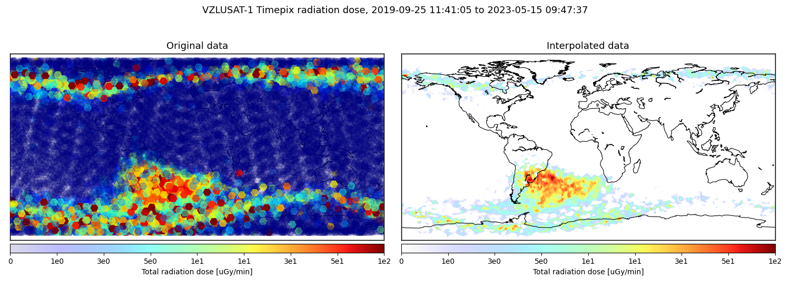

<details>
<summary><b><span style="color: red;"> >>> CLICK HERE TO SHOW THE INDIVIDUAL PLANETARY SWEEPS <<< </span></b></summary>
<p>

```bash
./scripts/labelled_maps_plotter.py -d ./data/labelled/planetary_sweeps/01_2019-09-25
```
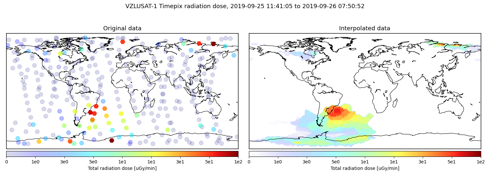

```bash
./scripts/labelled_maps_plotter.py -d ./data/labelled/planetary_sweeps/02_2019-09-26
```
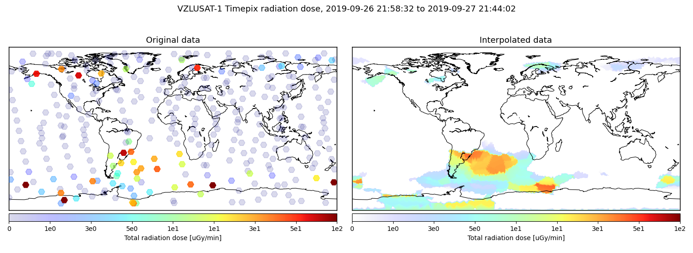

```bash
./scripts/labelled_maps_plotter.py -d ./data/labelled/planetary_sweeps/03_2019-11-04
```
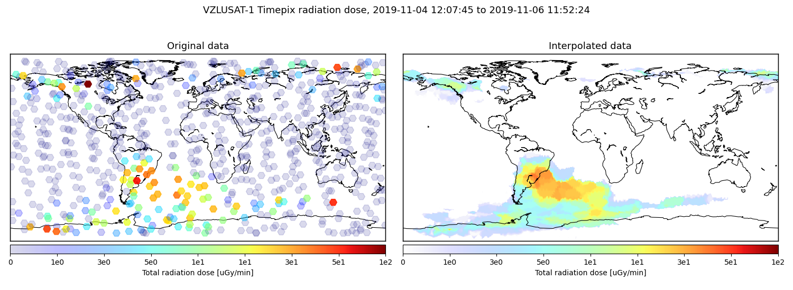

```bash
./scripts/labelled_maps_plotter.py -d ./data/labelled/planetary_sweeps/04_2019-11-16
```
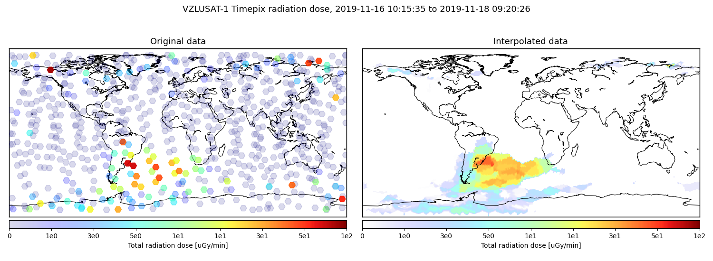

```bash
./scripts/labelled_maps_plotter.py -d ./data/labelled/planetary_sweeps/05_2019-11-28
```
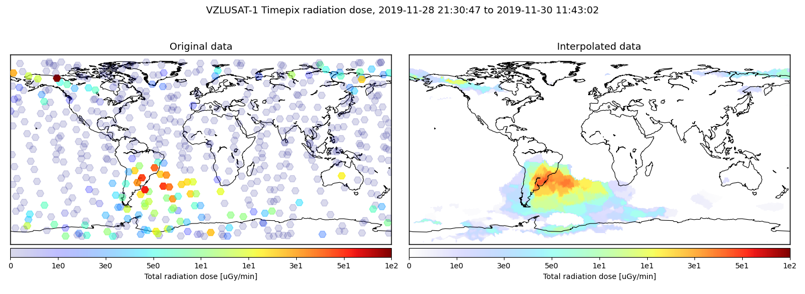

```bash
./scripts/labelled_maps_plotter.py -d ./data/labelled/planetary_sweeps/06_2019-12-20
```
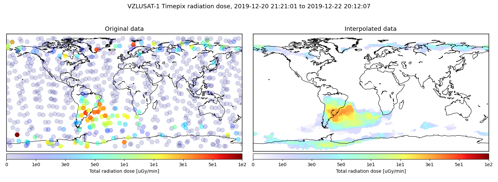

```bash
./scripts/labelled_maps_plotter.py -d ./data/labelled/planetary_sweeps/07_2020-01-07
```
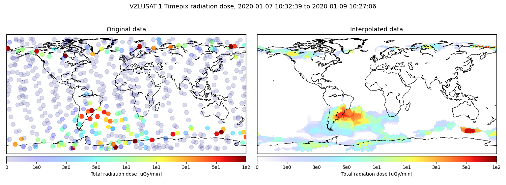

```bash
./scripts/labelled_maps_plotter.py -d ./data/labelled/planetary_sweeps/08_2020-02-11
```
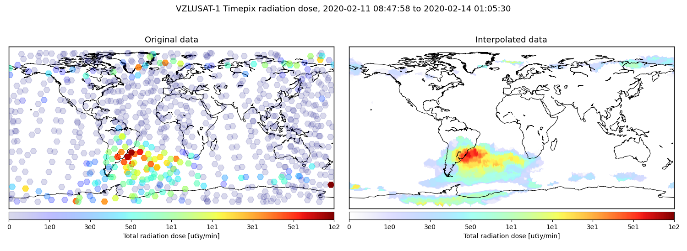

```bash
./scripts/labelled_maps_plotter.py -d ./data/labelled/planetary_sweeps/09_2020-03-05
```
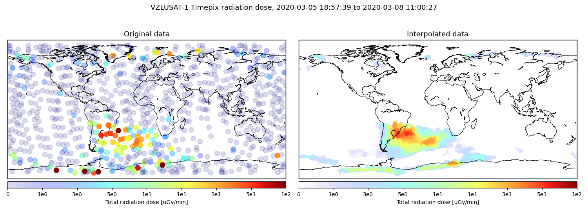

```bash
./scripts/labelled_maps_plotter.py -d ./data/labelled/planetary_sweeps/10_2020-03-16
```
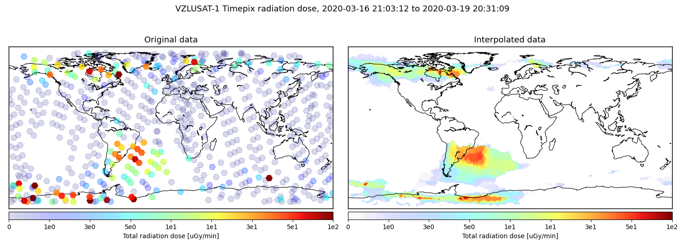

```bash
./scripts/labelled_maps_plotter.py -d ./data/labelled/planetary_sweeps/11_2020-05-22
```
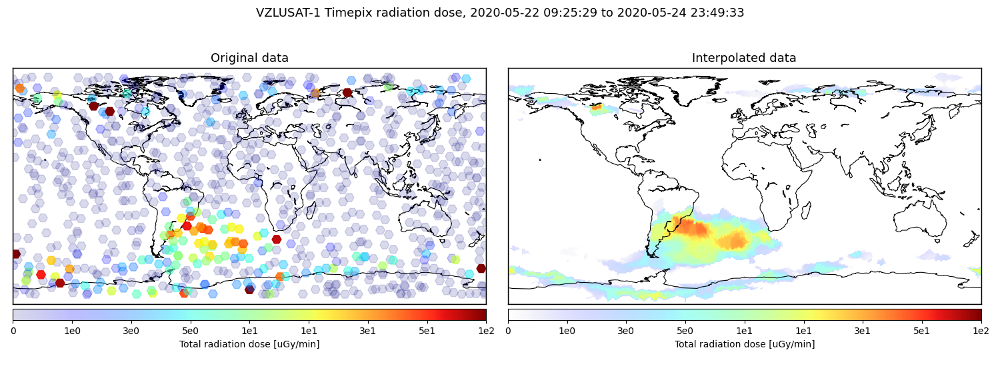

```bash
./scripts/labelled_maps_plotter.py -d ./data/labelled/planetary_sweeps/12_2020-06-09
```


```bash
./scripts/labelled_maps_plotter.py -d ./data/labelled/planetary_sweeps/13_2020-07-09
```
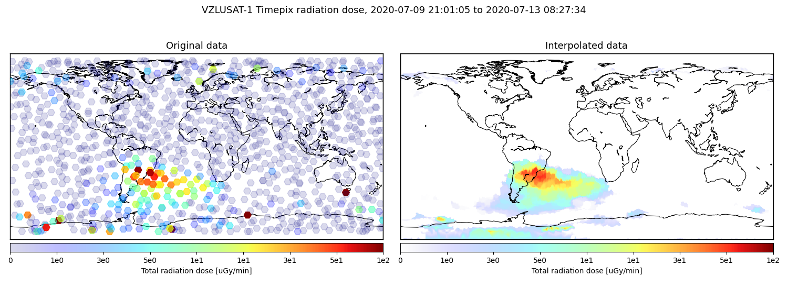

```bash
./scripts/labelled_maps_plotter.py -d ./data/labelled/planetary_sweeps/14_2020-09-26
```
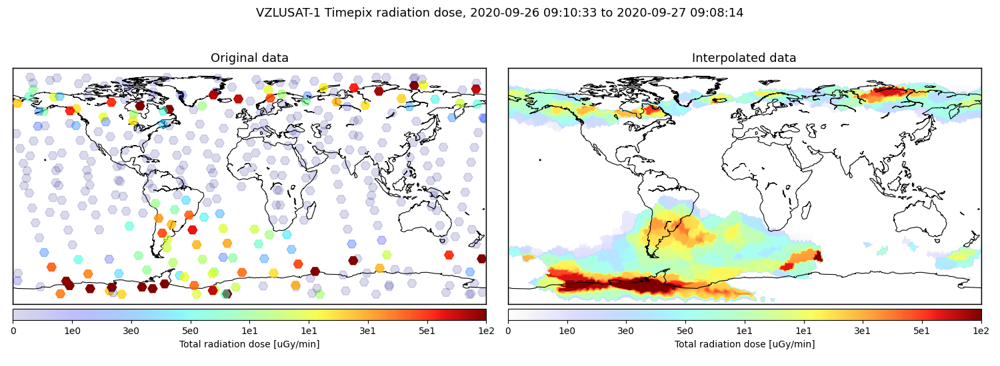

```bash
./scripts/labelled_maps_plotter.py -d ./data/labelled/planetary_sweeps/15_2020_11_21
```
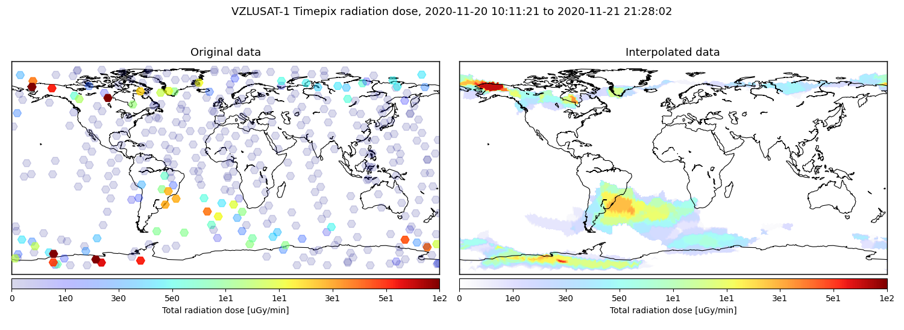

```bash
./scripts/labelled_maps_plotter.py -d ./data/labelled/planetary_sweeps/16_2021-05-03
```


```bash
./scripts/labelled_maps_plotter.py -d ./data/labelled/planetary_sweeps/17_2021-05-13
```


```bash
./scripts/labelled_maps_plotter.py -d ./data/labelled/planetary_sweeps/18_2021-05-27
```


```bash
./scripts/labelled_maps_plotter.py -d ./data/labelled/planetary_sweeps/19_2021-10-12
```


```bash
./scripts/labelled_maps_plotter.py -d ./data/labelled/planetary_sweeps/20_2021-10-30
```


```bash
./scripts/labelled_maps_plotter.py -d ./data/labelled/planetary_sweeps/21_2022-11-03
```


```bash
./scripts/labelled_maps_plotter.py -d ./data/labelled/planetary_sweeps/22_2022-11-08
```


```bash
./scripts/labelled_maps_plotter.py -d ./data/labelled/planetary_sweeps/23_2023-01-16
```


```bash
./scripts/labelled_maps_plotter.py -d ./data/labelled/planetary_sweeps/24_2023-04-20
```
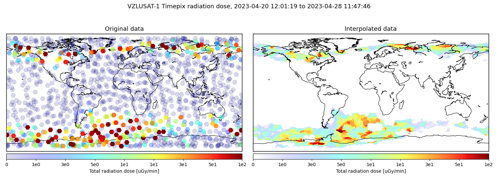

```bash
./scripts/labelled_maps_plotter.py -d ./data/labelled/planetary_sweeps/25_2023-05-10
```


</p>
</details>

### South-Atlantic Anomaly and polar belt scanning

Selective scanning of the SAA and the Polar belts used to be conducted before we were able to conduct planetary-wide sweeps.
Measurements were pre-planned on exact positions with acquisition time calculated using historic data.

```bash
./scripts/labelled_maps_plotter.py -d ./data/labelled/saa_and_poles
```
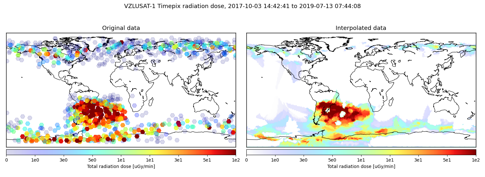

### Long acquisitions above Europe

Long acquisitions (10 s, 20 s) above Europe are triggered regularly by the ground segment when the satellite is in direct contact.
```bash
./scripts/labelled_maps_plotter.py -d ./data/labelled/above_europe
```
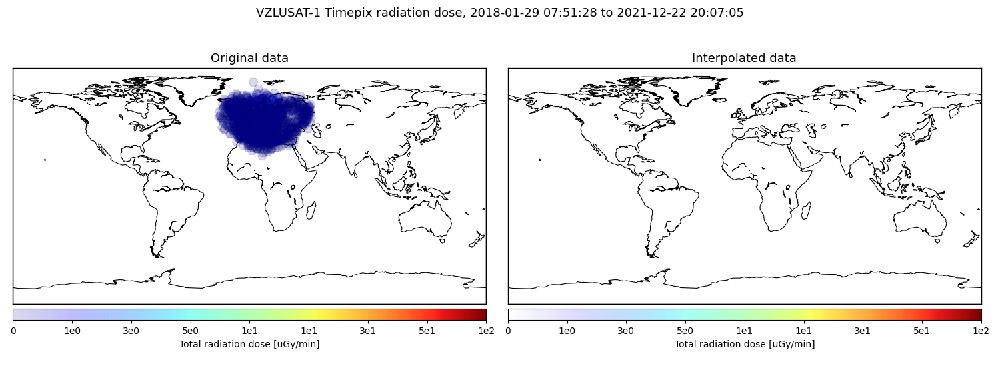

### All data

All valid full-resolution data measured by VZLUSAT-1.
All data are stored separately in compressed tar ball.
Unpack them by calling.
```bash
./data/extract_all.sh
```
The data were inspected by hand an any images that contained invalid information (noise, confused sensor, etc) or data of other character than radiation (direct Sun illumination) were removed.

#### All particle types

```bash
./data/download_all.sh
./scripts/labelled_maps_plotter.py -d ./data/all/labelled
```
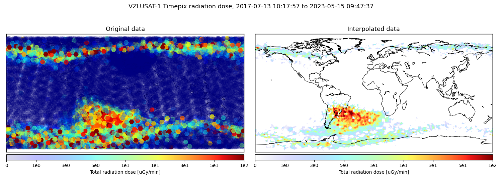

<details>
<summary><b><span style="color: red;"> >>> CLICK HERE TO SPLIT TO PARTICLE TYPES <<< </span></b></summary>
<p>

#### Weak beta, Gamma, X-ray

```bash
./data/download_all.sh
./scripts/labelled_maps_plotter.py -d ./data/all/labelled --filter dot
```
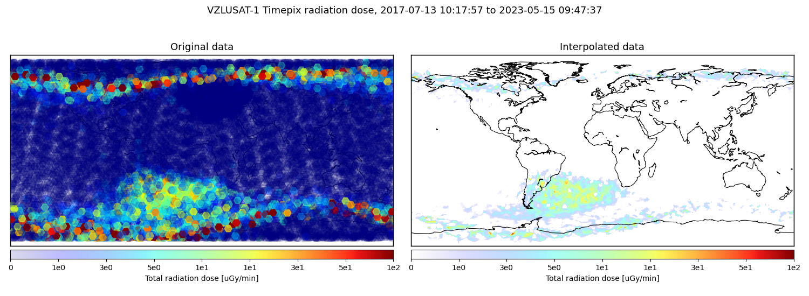

#### Ions, Alpha

```bash
./data/download_all.sh
./scripts/labelled_maps_plotter.py -d ./data/all/labelled --filter "blob_branched blob_big blob_small"
```
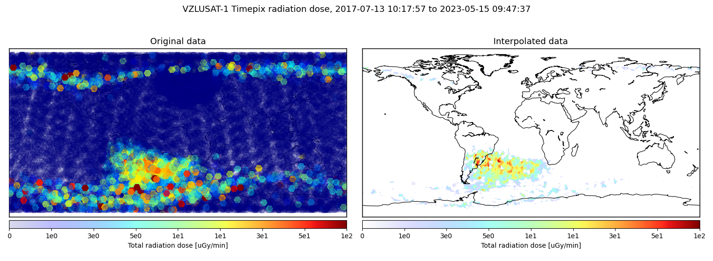

#### Beta

```bash
./data/download_all.sh
./scripts/labelled_maps_plotter.py -d ./data/all/labelled --filter "track_straight track_lowres track_curly"
```
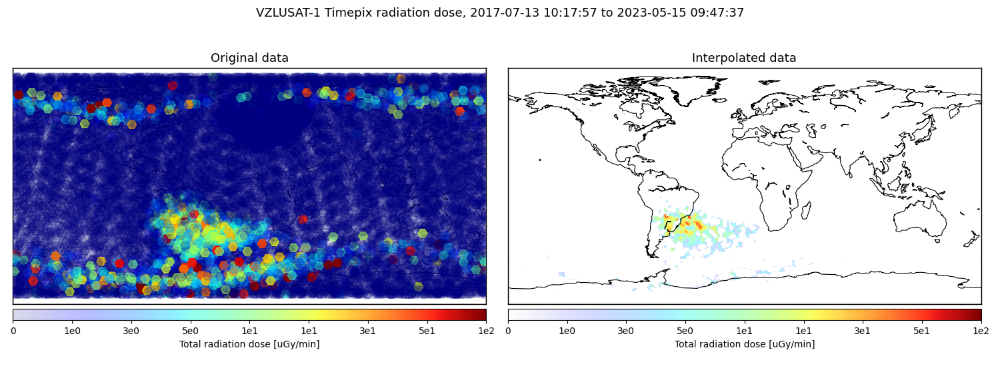

</p>
</details>

# Provided scripts

## Prerequisites

To use the attached scripts, you will need to install Python 3.0.
The required Python dependencies are listed in the `requirements.txt` file.
Prepare the Python virtual environment by running
```bash
./create_python_env.sh
```
Then, the provided scripts can be called directly.

## Map plotter

## Run on a particular folder with labelled data

```bash
./scripts/labelled_maps_plotter.py -d ./data/labelled/saa_and_poles
```

## Show map using selected subset of particle types

```bash
./scripts/labelled_maps_plotter.py -d ./data/labelled/planetary_sweeps/all --filter "track_straight track_lowres track_curly"
```

## Image browser

Run in the default configuration:

```bash
./scripts/labelled_image_browser.py
```

Display help:
```bash
./scripts/labelled_image_browser.py --help
```

Start at a specific file:
```bash
./scripts/labelled_image_browser.py -f ./data/labelled/planetary_sweeps/23_2023-01-16/1_fullres
```

Provide a specific data directory:
```bash
./scripts/labelled_image_browser.py -d ./data/labelled/saa_and_poles
```

Show data batch aggregated over 30 consecutive measurements. You can move between batches of that size using the GUI buttons.
```bash
./scripts/labelled_image_browser.py -b 30
```

Aggregate all files in the data directory (use the number of images as a batch size):
```bash
./scripts/labelled_image_browser.py --all
```

Display only a specific class of particle tracks:
```bash
./scripts/labelled_image_browser.py --filter track_curly
```
Images which do not contain the selected class will be skipped. Allowed filter options are: `dot`, `drop`, `track_curly`, `track_lowres`, `track_straight`, `blob_big`, `blob_branched`, `blob_small`, `other`.

Example: show all `track_straight`-type particle tracks within a particular data folder:
```bash
./scripts/labelled_image_browser.py -d ./data/labelled/planetary_sweeps/23_2023-01-16 --all --filter track_straight
```
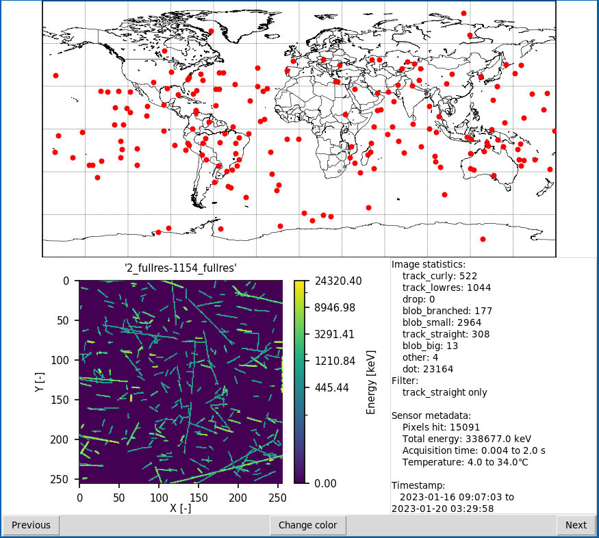

### Notes

* When providing a filename, do not use the suffixes such as `.statistics.txt`, `.clusters.txt` or `.metadata.txt`
* Arguments `-d`, `-b` and `-f` may be used together
